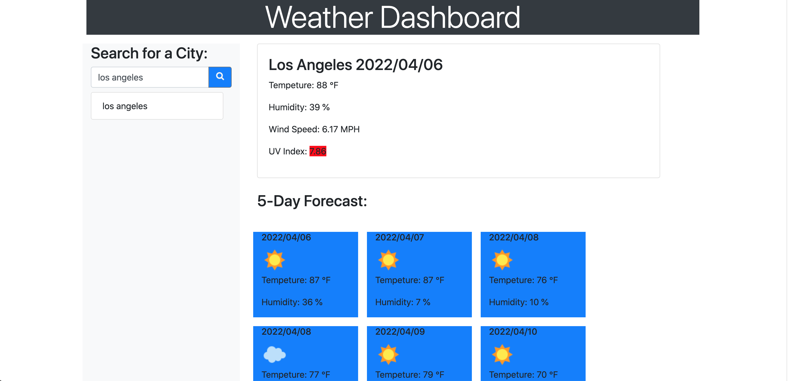

# 06-Server-Side-APIs-Weather-Dashboard
Weather Dashboard that retrieves data form another application's API.
 
## Getting Started
These instructions will get you a copy of the project up and running on your local machine for development and testing purposes. See deployment for notes on how to deploy the project on a live system.

```
$ git clone git@github.com:jkgdev8/Weather-Dashboard-UCLA-Challenge-6.git
$ cd Weather-Dashboard-UCLA-Challenge-6.git

## Preview


## Link
https://jkgdev8.github.io/Weather-Dashboard-UCLA-Challenge-6/

## Repo
https://github.com/jkgdev8/Weather-Dashboard-UCLA-Challenge-6


## Built With

* [HTML](https://developer.mozilla.org/en-US/docs/Web/HTML)
* [CSS](https://developer.mozilla.org/en-US/docs/Web/CSS)
* [JS](https://developer.mozilla.org/en-US/docs/Web/JavaScript)
